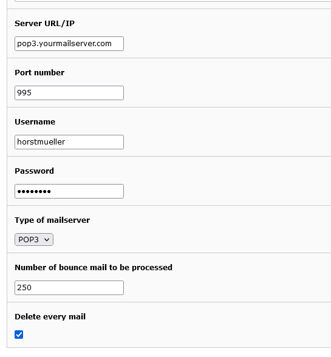
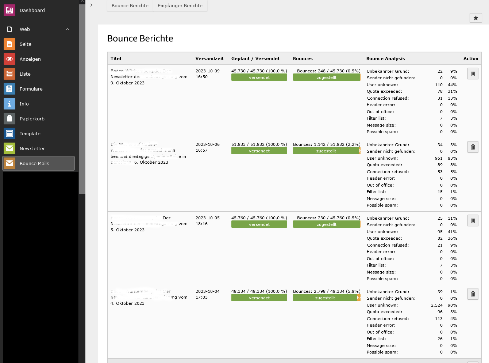
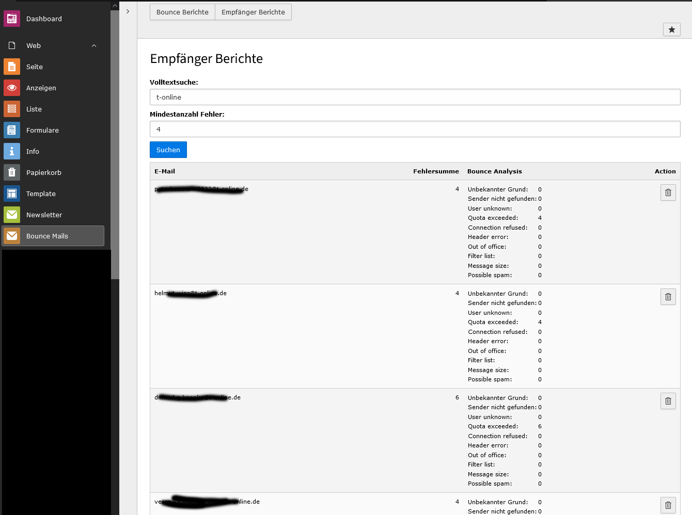
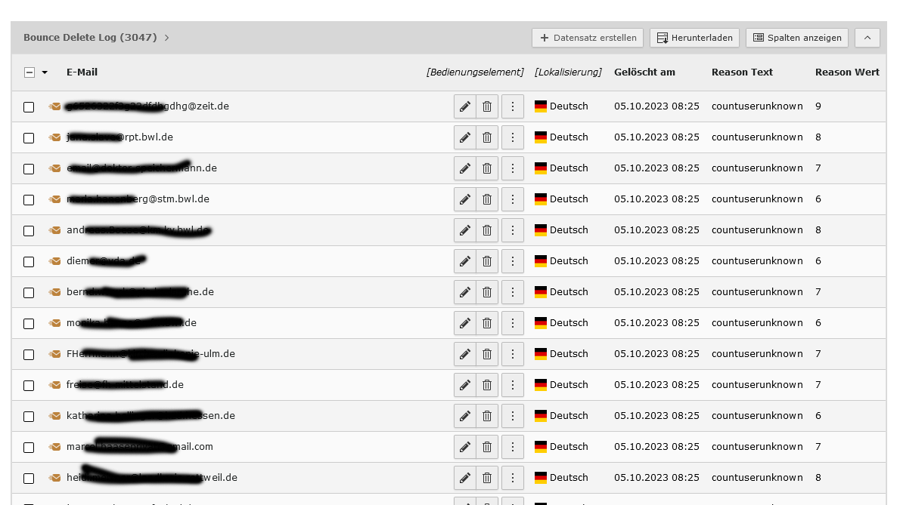
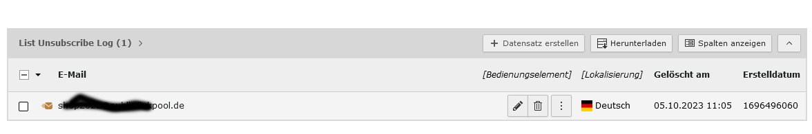

# EXT:rsmbouncemailprocessor 
A TYPO3 Extension for newsletter bounce handling

# Introduction
## Why did we create the "rsmbouncemailprocessor" extension?
- When sending newsletters for many years, the number of bounces will increase. The more bounces you send, the worse the sender's ranking with email providers like Gmail, Yahoo, T-Online and so on.
- The idea behind the extension is to achieve automatic bounce handling for newsletters and thus minimize the rate of bounces.
- Furthermore the extension supports list unsubscribe header handling via e-mail

## Requires
- This extension was developed for use with [cute_mailing](https://extensions.typo3.org/extension/cute_mailing/) by undkonsorten
- cute_mailing should be used with [tt_address](https://extensions.typo3.org/extension/tt_address/) to allow automatic cleaning of email addresses
- When sending the newsletters, an e-mail address must be defined as the sender to which bounce e-mails are delivered. This e-mail address must be a POP3 / IMAP account

## Features
- Automatic reading of e-mails received in the bounce mailbox via POP3 or IMAP.
- Analyze the emails based on the headers set by cute_mailing (X-TYPO3RCPT and X-TYPO3NLUID)
- Reading the original recipient (aka E-Mail) from the header field X-TYPO3RCPT (fallback x-failed-recipients) and the newsletter from the header field (TYPO3NLUID as the cute_mailing sendout)
- Analyzes the reason for the bounce mail using a rule set extensible via TS
- Analyzes the mails generated by mail apps with the "list unsubscribe header" and removes those addresses
- Generates statistics per newsletter with the reason of bounces
- Generates statistics per recipient with the reason of bounces
- Deletes recipients from tt_address when one or more bounde reasons have exceeded their limit
- Logging the deletion of recipients by bounce handling
- Logging the deletion of recipients by "list unsubscribe header" handling
- Offers some Cleaner-tasks to clean taskqueue, recipient-reports, receiver-report, delete-logs entries

# Setup

## Installation

Install this extension from the [TYPO3 Extension Repository](https://extensions.typo3.org/extension/rsmbouncemailprocessor/) and activate
the extension in the Extension Manager of your TYPO3 installation.

Once installed, configure cute_mailing and then this extension

## configure your POP3 / IMAP email bounce account
- Create a POP3/IMAP enabled E-Mail account, for example bounce@myfancydomain.de. 

## configure cute_mailing
The configuration is made by cute_mailing [page-TS](https://docs.typo3.org/p/undkonsorten/typo3-cute-mailing/3.1/en-us/Configuration/Index.html#page-ts-config)

These following settings are important for us:

Set the bounce email address from as the sender / reply to address

```
reply_to = bounce@myfancydomain.de
return_path = bounce@myfancydomain.de
```

enable the "list unsubscribe header"

```
listunsubscribe_enable = 1
listunsubscribe_email = bounce@myfancydomain.de
```


## configure this extension by TS
The configuration is made by Typoscript-Setup!

You'll find an example in the default configuration in Configuration/TypoScript/setup.typoscript.
All the parameters are explained in the file.
Just copy that file, edit it for your user and include it. 

#### settings.reasontext
You should not change settings.reasontext unless you know what you are doing.

#### settings.deletelog 
You should enable the delete log via settings.deletelog.enabled and the settings.deletelog.pid.

#### settings.deletelimits
Check out the settings.deletelimits! 
The delete limits specify how often (per emal / address) a bounce-reason must occur so that the recipient is deleted from the tt_address table.
Without changing these values, no addresses will be deleted!

### settings.deletetables
Check out settings.deletetables if you want the tables mentioned there to be cleaned automatically.
This is an optional feature.


## configure the taskplaner tasks
There are several TYPO3 tasks which are partly otpional.

### RSM analyze bounce mail (rsmbouncemailprocessor)
This is the primary task that reads and analyzes the bounce-mails and created the statistics. 
So, yes, this task is required.

Let's say you've 40.000 recipients and you're sending 2.000 mails every 15 minutes.
Your recipient ist quite old and you expect 10% bounces.
Your POP3 is small and can store 800 mails.
Your POP3 account would be full after one hour. So it would make sense to retrieve the POP3 mails every 30 minutes.

This task should thus be started every 30 minutes - or more often. 


The **server** options are the data that apply to your POP3 / IMAP account.

```
Server URL/IP: The IP or URL of your mail server (e.g.: pop3.yourmailserver.com)
Port number: The port number of your mail server (e.g.: 995)
Username: The username / login for the mail account (e.g.: horstmueller)
Password: The password / login for the mail account (e.g.: geheim0815)
Type of mailserver: Either POP3 or IMAP. POP3 should be a goog option.
```


For **other** options here a few hints:

```
Number of bounce mail to be processed: 250
```

We use the PHP IMAP class to read the mails. With a lot of mails this class becomes very slow, so the value should not be too high. 
We have had good experiences with a value of 250.

```
Delete every mail
```

Normally your POP3 account has a maximum size and no human has the time to read bounce mails.
If you set this option to true, what we're recommending, you make sure that the POP3 account will never overflow.


### RSM process bounce mail (rsmbouncemailprocessor)

This is the second task entry that scans the recipient-report table for addresses to be deleted. 
This requires that the settings.deleteimits have been set in the TS-Setup!

You can run this task once a day e.g. in the early morning or whenever you prefer.   


### RSM clean task queue (rsmbouncemailprocessor)

This is the third task and it is used for data cleaning. It is optional!

You can run this task once a day e.g. in the early morning or whenever you prefer.

This task is again set up by the TS-setup options. See settings.deletetables!

### The Backend Module

The extension comes with it's own BE module for displaying bounce reports and recipient reports

**bounce report**



**recipient report**




### The TYPO3 List

If you have set up the deletelog, you'll will find some lig entries in the TYPO3 BE list. See deletelog-pid.

**Delete Log**



**List Unsubscribe Log**



## TODOs
- none at the moment


## Credits

This extension was created by Ralph Brugger for [ressourcenmangel](https://www.ressourcenmangel.de/).
Many thanks to Eike Starkmann from [undkonsorten](https://www.undkonsorten.com/) for developing and extending cute_mailing!

